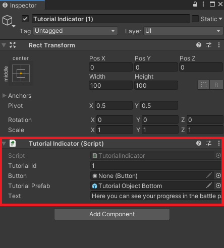

# Descrição do Trabalho

// Acrescentar neste capítulo as subsecções (4.3.1, 4.3.2, …..) que forem necessárias para descrever o trabalho desenvolvido ….&#x20;

// Acrescentar em cada secção, referida anteriormente, os subtópicos que forem necessários.

Durante  a minha estadia na Cooperativa de Profissionais de Desenvolvimento de Software desempenhei várias tarefas relacionadas com o projeto que estive incluído, o Curse Chasers. &#x20;

### Criação de um GitBook para o relatório&#x20;

Para a realização do presente relatório de estágio, foi-me  sugerido a criação de um GibtBook, de modo a que os orientadores conseguissem ver as alterações que eram feitas á medida que o relatório ia sendo escrito. Para isso criei um novo repositório no meu GitHub no qual existem dois branches, master e develop. Á medida que ia fazendo alterações no GitBook, dava merge das alterações feitas no relatório para develop e fazia um Pull Request, colocando os orientadores como reviwers para poderem ver al alterações feitas e se necessário fazer algum comentário sobre o que pode ser melhorado. Quando o Pull Request é aceite, as alteraçoes são efetuadas no branch master.


### Quality Assurance (QA) e Bug fixing

Nos primeiros dias do meu estágio na Cooperativa, realizei um pouco de Quality Assurance (QA) com o objetivo de testar o Curse Chasers e fazer um levantamento de Bugs e features que pudessem ser melhoradas no jogo.

Após o primeiro levantamento de Bugs foi foram criadas novas tasks no ClickUp de modo a organizar o trabalho e ajudar no controlo do mesmo. Seguidamente tive de tentar encontrar a origem dos Bugs encontrados através de debuging do código, tentando encontrar alguma irregularidade que possa estar na origem do problema ao qual quero resolver. Para isso algumas das ferramentas que me foram bastante uteis  foram a utilização de Assertions e Debug Logs que me ajudavam a visualizar os estados de algumas variavéis ou os seus valores na consola do Unity de modo a perceber melhor como está a ser executado o código.


```csharp
Debug.LogError( $"endZonePoints{endZonePoints.Count}" );
```



```csharp
Assert.IsTrue( CurrentBoardState != null );
```


Quando tentamos resolver um bug temos duas opções, resolver o bug por completo ou fazer um hot-fix. Um hot-fix é usado quando queremos uma resolução rápida do problema para lançar uma feature nova. Ao usra um hot-fix criamos Technical Debt, ou seja , implica voltar ao código mias tarde para melhorar a resolução ou a performance do que foi alterado, o que por vezes não é a melhor solução pois estamos a deixar para mais tarde o que se pode fazer no momento, mas por vezes é a forma de conseguir que a feature seja lançada no tempo previsto.

### Implementação de novas features no jogo

Com o decorrer do estágio também me foi pedido o melhoramento e a implementação de novas features no jogo.&#x20;

#### Implementação de novos steps no tutorial

Um exemplo de melhoramento de uma feature foi a implementação de novos passos no tutorial do jogo onde implementei o tutorial para instruções para ganhar os jogos, Lembrar o jogador para testar outras moves, explicar quando é possível utilizar as super moves e fazer um tutorial para o battle pass.

Para isso, nos tutoriais que era necessário acrescentar passos a um tutorial já existente tinha de criar um novo tutorial indicador e depois colocar o mesmo no tutorial desejado no tutorial manager. Se o tutorial desejado nao existisse, tinha de criar um novo tutorial novo no tutorial manager e depois disso criar os tutorial indicators do tutorial.&#x20;




#### Correção de preços de items e In-app purchases

Ainda nos melhoramentos do jogo, tive de atualizar os preços dos items no jogo e nas In-app purchases a pedido do cliente, onde peguem numa spreeadsheet dada pelo mesmo e atualizei os preços e descrição dos items no scriptable object dos items do jogo, bem como na Google Play Console, onde fiquei a perceber como funciona o sistema de pagamento e de atualização de valores da Google.


 

#### Implementação de uma animação do Match Eye

A pedido do cliente quando um jogador está á procura de um adversário implementei uma animação em uma sprite ja existente, o Match Eye, para isso tive de pegar na imagem e no Photoshop separar os dois elementos da imagem, olho e pupila, de modo a ter dois elementos para realizar a animação. Após ter os dois elementos da imagem utilizei o animator do unity para fazer a animação onde o olho agora fica a olhar de um lado para o outro enquanto procura por um adversário.


#### Trocar imagens nos bundles de Fairy Dust

Outros dos melhoramentos do UI do jogo foi a troca das imagens dos bundles de Fairy Dust, moeda do jogo, onde peguei numa imagem que continha todos os elementos a ser utilizados e no Photoshop separei esses elementos sempre com o cuidado de o tamanho da imagem ser em power of two para o Unity conseguir aplicar a compressão na imagem. Por exemplo as imagens podem ser 1024x1024 pixeis. Crie também uam imagem apra um novo item de 200 Fairy Dust para substituir as collor pallets que foram retirados do jogo a pedido do cliente e eram algumas das recompensas do Battle Pass.

    
