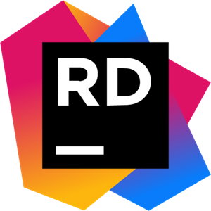

# Rider

O JetBrains Rider é um IDE cross platform baseado na plataforma Intellij.É possivel utilizar o Rider para escrever e editar o código em várias linguagens de programação. para o projeto foi utilizado C#. Foi escolhido o Rider pela sua integração com o Unity que foi utilizado para o desenvolvimento do projeto.
